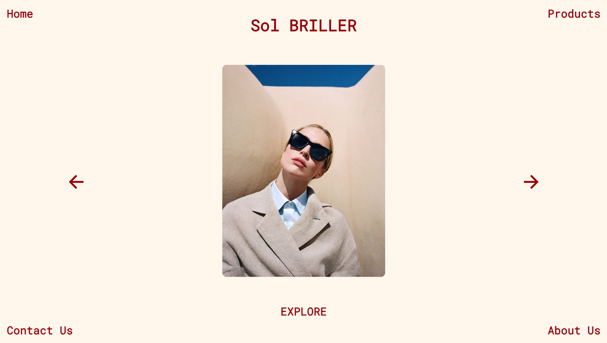
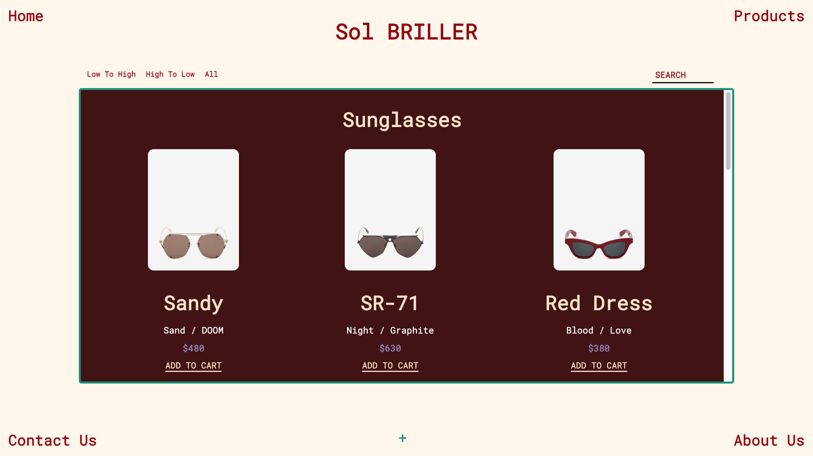
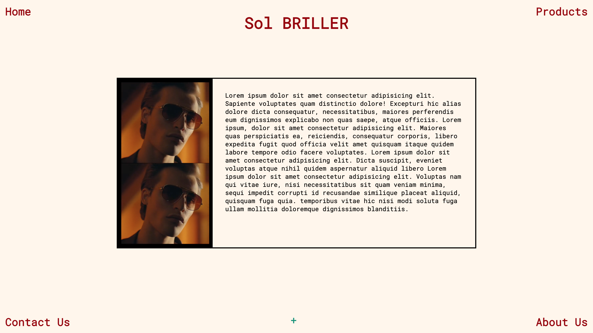
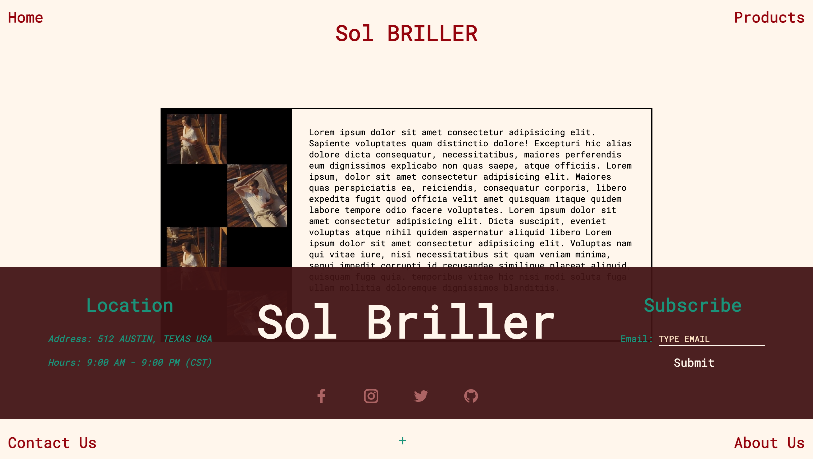

 # **Sol Briller**
 Re-created e-commerce project w/ React. Completely changed the design aspect, I went for a more simple yet innovative approach. Includes MySQL / RDS Server. Inspired by my interest outside of software development. Hosted with Netlify / Heroku. **Enjoy**!!!

 > [Sol Briller](https://lively-travesseiro-3ac36e.netlify.app/) - Website Link

 ## Software Engineer / Creator
 - Jorge L 
 - Road To Hire Program 2022

## **Built with**
* [React](https://reactjs.org/) - React is a JavaScript library developed by Facebook.
* [CSS](https://developer.mozilla.org/en-US/docs/Web/CSS) - Main styling.
* [MySQL](https://www.mysql.com/) - The relational database management system used.
* [MySQL Workbench](https://www.mysql.com/products/workbench/) - Unified visual tool used.
* [Node.js](https://nodejs.org/en/) - Open source development platform (server-side) used.
* [Express.js](https://expressjs.com/) - Node.js framework used. 

### **Home page**

### **Products page**

### **Contact page**

### **About page**

### **Footer**

## **License**
This project is licensed under the MIT license - see the [LICENSE](./client/LICENSE) file for details.